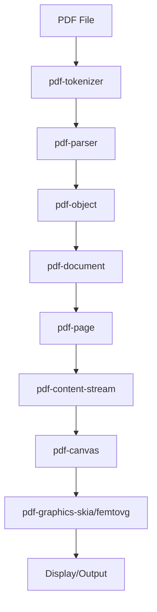

# safe-pdf

[](https://github.com/Velli20/safe-pdf/actions)
[](LICENSE)


A **PDF reader and renderer** written in Rust. `safe-pdf` provides a robust, memory-safe, and extensible foundation for working with PDF files, ideal for both end-users and developers.
Status: this project is under active, heavy development (pre-alpha; APIs may change without notice). Contributions, feedback, and issue reports are very welcome.

---

## 🚏 System Architecture

`safe-pdf` is organized as a modular Rust monorepo, with each core PDF concept implemented as a separate crate.

### Key Components

- **pdf-tokenizer**: Lexical analysis of PDF byte streams into tokens.
- **pdf-parser**: Syntactic parsing of tokens into PDF objects and structures.
- **pdf-object**: In-memory representation of all PDF object types (dictionaries, arrays, streams, etc.).
- **pdf-document**: High-level API for loading, validating, and traversing PDF documents.
- **pdf-page**: Page tree, page objects, and resource management.
- **pdf-content-stream**: Parsing and dispatching PDF drawing/text operators.
- **pdf-canvas**: Abstracts 2D drawing operations, delegating to a backend.
- **pdf-graphics, pdf-graphics-skia, pdf-graphics-femtovg**: Rendering backends for different graphics engines.
- **pdf-renderer**: Handles rendering of PDF pages using a chosen backend.
- **pdf-font**: Font parsing, encoding, glyph access (Type1/TrueType/Type3).

### Data Flow

1. **Input**: PDF file bytes
2. **Tokenization**: `pdf-tokenizer` → tokens
3. **Parsing**: `pdf-parser` → PDF objects
4. **Object Model**: `pdf-object` → in-memory structure
5. **Document API**: `pdf-document` → high-level access
6. **Page Handling**: `pdf-page` → page tree, resources
7. **Content Stream**: `pdf-content-stream` → operator dispatch
8. **Canvas Abstraction**: `pdf-canvas` → drawing commands
9. **Rendering**: `pdf-graphics-*` → pixels on screen or image

### Module Interactions



---

## 🗂️ Module Structure

Project directory layout:

```text
safe-pdf/
├── AGENTS.md
├── Cargo.toml
├── README.md
├── crates/
│   ├── pdf-canvas/           # 2D drawing abstraction and stateful canvas API
│   ├── pdf-content-stream/   # PDF content stream operator parsing and dispatch
│   ├── pdf-document/         # High-level PDF document API
│   ├── pdf-font/             # Font parsing and management
│   ├── pdf-graphics/         # Common graphics types (color, transform, etc.)
│   ├── pdf-graphics-femtovg/ # FemtoVG rendering backend
│   ├── pdf-graphics-skia/    # Skia rendering backend
│   ├── pdf-object/           # PDF object model (dictionaries, arrays, etc.)
│   ├── pdf-page/             # Page tree, page objects, resources
│   ├── pdf-parser/           # PDF syntax parser
│   ├── pdf-postscript/       # (Optional) PostScript support
│   ├── pdf-renderer/         # High-level rendering orchestration
│   ├── pdf-tokenizer/        # Tokenizer for PDF byte streams
├── examples/                 # Example applications (Skia, FemtoVG)
│   ├── skia.rs
│   ├── femtovg.rs
│   └── Cargo.toml
└── target/                   # Build output
```

---

## 🧩 Design Decisions & Patterns

- **Layered, Decomposed Architecture**: Clear separation between tokenization, parsing, object modeling, document semantics, page/resource resolution, operator dispatch, and rendering keeps concerns orthogonal and testable.
- **Monorepo of Focused Crates**: Each conceptual layer lives in its own crate (e.g. `pdf-tokenizer`, `pdf-parser`, `pdf-object`), enabling incremental compilation, targeted benchmarks, and reuse in non‑rendering contexts (indexers, validators, analyzers).
- **Pluggable Operator Handling**: Content stream operators are dispatched via traits, so you can substitute a renderer with: (a) a metrics collector, (b) a static analyzer, or (c) a custom export (SVG, canvas, etc.) without forking core logic.
- **Backend Agnosticism via `CanvasBackend`**: Rendering pipelines interact only with an abstract canvas; Skia / FemtoVG backends demonstrate how GPU / vector engines can be integrated with minimal glue.
- **Error Handling Discipline**: Rich domain errors (using `thiserror` inside crates) + `Result` everywhere; workspace Clippy configuration forbids `unwrap` / `expect`, reducing accidental panics.
- **Safety First (`unsafe_code` forbidden)**: The workspace lints disallow `unsafe` by default. Any future exception must be narrowly scoped and justified in docs.
- **Extensible Font System**: `pdf-font` isolates font decoding (Type1 / TrueType / Type3 WIP) so shaping / caching strategies can evolve independently of rendering.
- **Predictable Rendering Pipeline**: `PdfRenderer` orchestrates: page resource resolution → content stream execution → backend drawing; easy insertion points for caching or preflight stages.
- **Testing Strategy**: Unit tests live close to logic in each crate; cross‑crate integration & rendering behavioral tests will accumulate in a higher-level test harness (planned) to diff raster/command outputs.
- **Instrumentation Friendly**: Because operator visitation is trait-based, adding logging / tracing / telemetry layers does not require modifying PDF interpretation logic.
- **Minimal Global State**: State (graphics, text, resources) is threaded explicitly through contexts to simplify future concurrency and parallel page rendering.
- **Clarity Over Cleverness**: Prefer small, explicit functions and well-named types over macro indirection; easier for contributors new to PDF internals.


## 🚀 Quick Start

Clone the repository and run tests:

```bash
git clone https://github.com/Velli20/safe-pdf.git
cd safe-pdf
cargo test
```
---

## 🖥️ Running the Examples

The `examples/` workspace member contains runnable showcase applications. Currently two rendering backends are available behind feature flags: Skia (OpenGL) and FemtoVG (wgpu).

### Example Assets

Sample PDFs used for experimentation live in `examples/assets`:

```
examples/assets/
    Gradients.pdf
    PlaygroundMDN.pdf
    RadialGradientFills.pdf
    W3Schools.pdf
    is.pdf
    test6.pdf
    webgl.pdf
```

### Run the Skia Backend (interactive viewer)

This launches an OpenGL + Skia window. Pass the path to a PDF (relative or absolute) as the final argument. Use Up / Down arrow keys to change pages.

```bash
cargo run --example skia --features skia -- examples/assets/webgl.pdf
```

### Run the FemtoVG Backend (WIP)

FemtoVG + wgpu prototype (may be less feature complete):

```bash
cargo run --example femtovg --features femtovg
```

The FemtoVG example embeds a small PDF internally (see `femtovg.rs`). You can adapt it to load external files similarly to `skia.rs`.

### Adding a New Backend

Implement the `CanvasBackend` trait (see `pdf-canvas`) and create a new crate similar to `pdf-graphics-skia`. Then expose it behind a feature flag in `examples/Cargo.toml` so it can be opt‑in at runtime.

---

## 🤝 Contributing

Contributions are welcome! Please see [CONTRIBUTING.md](CONTRIBUTING.md) for guidelines, or open an issue to discuss your ideas.

---

## 📄 License

This project is licensed under the MIT License. See [LICENSE](LICENSE) for details.

SPDX-License-Identifier: MIT

